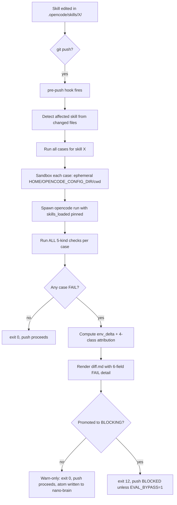
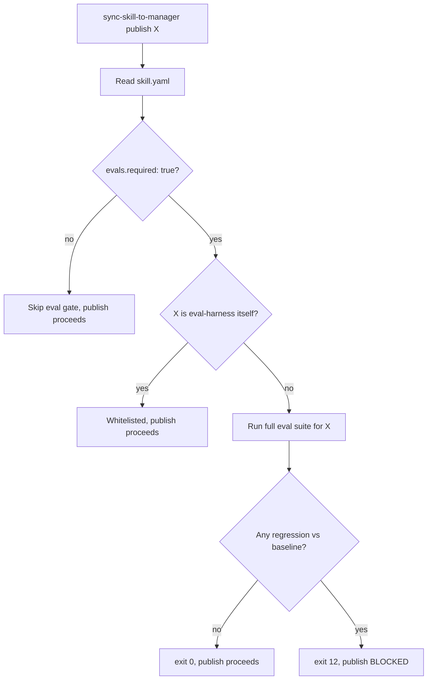

# @nano-step/eval-harness

**v0.2.0** — Behavior-regression eval harness for [opencode](https://github.com/sst/opencode) skills.
> Highlights since v0.1.x: per-case model override, project-config layer (`.opencode/eval-harness.yaml`), per-repo registry, flock-based concurrency, dollar-cost reporting via `pricing.json`, 3-sample stability check, and scaffolded opencode Stop hook. See `CHANGELOG.md`.

> Scope statement: v0.1.0 measures **behavior regression** for **structured-output skills**. It is NOT a skill reviewer, NOT a quality grader, NOT a general-purpose evaluator. Prose-output skills (`pr-code-reviewer`, `od-workflow`, …) are deferred to v0.3 (LLM judge).

## What it does

Given a baselined opencode skill, eval-harness detects when behavior has regressed since the baseline, attributes the cause, and tells you exactly what changed.

```
$ git push origin main
[eval-harness] pre-push: detected change in .opencode/skills/omo-session-distiller/**
[eval-harness] running 3 cases (skills-only scope, fast tier)
[eval-harness] Case 1/3 atom-shape-basic                       PASS (3.9s)
[eval-harness] Case 2/3 atom-tags-decision-architecture        FAIL
[eval-harness] Case 3/3 atom-redaction-pii                     PASS (3.1s)
[eval-harness] Stability check: 3 samples byte-identical → real FAIL
[eval-harness] FAIL 1/3 — see runs/2026-05-28T11-42-08/diff.md
[eval-harness] WARN-ONLY MODE: push proceeding. Promote with `eval-harness promote`.
```

## Install

```bash
npm install -g @nano-step/eval-harness
```

Or use directly from a clone:

```bash
git clone https://github.com/nano-step/eval-harness.git
export PATH="$PWD/eval-harness/scripts/eval:$PATH"
```

## Quick start (5 min)

```bash
# 1. Run the canonical demo (mutates omo-session-distiller, runs eval, reverts)
npm test

# 2. Use it on a real skill — first baseline
eval-harness baseline --skill omo-session-distiller

# 3. Edit the skill, then run again
eval-harness run --skill omo-session-distiller
# → exit 12 if regression detected
```

## Architecture (v0.1.0)

```
scripts/eval/
├── run.sh                    # entrypoint: --case --skill --debug --full --pin-env
├── baseline.sh               # writes baseline.json (explicit command)
├── accept.sh                 # accept --case [--bless-env]
├── status.sh                 # pull-only result inspection
├── promote.sh                # warn-only → blocking promotion
├── trend.sh                  # reads history.ndjson
├── lib/
│   ├── spawn.sh              # invokes `opencode run` with sandboxed env
│   ├── score.sh              # runs all checks against transcript + fs
│   ├── diff.sh               # 6-field FAIL output computation
│   ├── attribute.sh          # 4-class attribution decision tree
│   ├── manifest.sh           # env-manifest capture
│   └── stability.sh          # 3-sample byte-identical check on FAIL
├── hooks/
│   ├── pre-push              # git hook installer target
│   └── sync-publish.sh       # sync-skill-to-manager pre-publish hook
└── tests/regression_inject.sh   # the canonical demo
```

## v0.1.0 design highlights

- **Bash + jq + flock**. No daemon, no Node CLI, no Unix socket.
- **3 auto-triggers**: `sync-skill-to-manager` pre-publish · git `pre-push` on skill edits · manual `eval-harness run`. (Stop hook deferred — opencode plugin API unverified.)
- **6-field FAIL schema**: `failed_check_id`, `expected`, `actual`, `diff_hint`, `transcript_span`, `env_delta`.
- **4-class attribution**: `SKILL_CHANGED`, `FIXTURE_STALE`, `MODEL_CHANGED`, `UNKNOWN_DRIFT`.
- **3-sample byte-identical stability check** on FAIL → flaky tag if mismatch, no false attribution.
- **Warn-only by default** for 7 days. Promote with `eval-harness promote`.
- **Two-stage `accept`**: default updates fixtures only; `--bless-env` required to update env-manifest (with confirmation).
- **Cost ceiling**: `EVAL_BUDGET_USD=2.00` hard daily cap. Tokens-based capture.
- **One-command rerun** in every FAIL output.

---

## What this harness scores (the factors)

Be explicit about what is and isn't checked. v0.1.0 evaluates **two layers** with different jobs:

### Layer 1 — Behavior factors (eval-harness itself, this repo, this version)

Every case in `.opencode/skills/<skill>/evals/cases/*.yaml` declares one or more **checks**. The harness runs **all checks** per case and aggregates failures. v0.1.0 supports exactly **5 check kinds**:

| # | Check kind | What it scores | Reliability |
|---|---|---|---|
| 1 | `shell`            | Runs a shell command in the case workdir; matches stdout against `expect_regex` / `expect_min` / `expect_exact`. | High — deterministic. |
| 2 | `jq_path_contains` | Reads a JSON file in workdir, walks a jq path, asserts the result array contains all `contains:` values. | High — deterministic. |
| 3 | `file_exists`      | Asserts a file exists at the given path in workdir. | High — deterministic. |
| 4 | `output_contains`  | Greps the opencode transcript for a literal string. Records `transcript_span` on hit. | High — deterministic, literal-only. |
| 5 | `output_not_contains` | Inverse of #4. Used for refusal / forbidden-output checks. | High — deterministic, literal-only. |

**Hard scope guardrail**: a skill that produces prose without structured output **cannot be evaluated reliably with these 5 kinds**. Prose evaluation lands in v0.3 (LLM-judge with cross-model debias). If your case YAML uses an unrecognised `kind:`, the harness emits an `error: true` result and excludes it from regression diff — it does not silently pass.

### Layer 2 — Environment & attribution factors (for FAIL diagnosis)

When a case fails, the harness attributes the cause using **4 environment-manifest fields** captured per run:

| Manifest field | Catches |
|---|---|
| `skill_bundle_sha` (transitive hash of all skills) | `SKILL_CHANGED` |
| `skill_sha` (just this skill) | `SKILL_CHANGED` (narrower) |
| `fixture_sha` (case fixture directory) | `FIXTURE_STALE` |
| `model_id` + `opencode_version` | `MODEL_CHANGED` |
| (none of the above changed) | `UNKNOWN_DRIFT` |

These four are everything attribution looks at in v0.1.0. `MCP_FLAKE` and `HARNESS_BUG` are designed but not shipped (deferred until they bite).

### Layer 3 — Skill *design* factors (NOT in this repo)

A separate concern, deferred to a future `skill-reviewer` tool. v0.1.0 does **not** review skill design quality (trigger phrase collisions, frontmatter shape, examples present, security greps, bundle size, etc.).

A draft heuristic for design review lives at [`standards/skill-quality-v1.md`](./standards/skill-quality-v1.md). Read it understanding that:

- **13 of 30 factors** are grounded in real sources (Anthropic Skills doc + OWASP shell-security greps + MCP tool conventions). Reliable to apply.
- **17 of 30 factors** are heuristic synthesis from pattern-matching across one workspace. Use with judgment; treat as "things to consider," not "things that pass/fail."
- There is **no published, authoritative skill-quality benchmark** in the industry today. Anyone claiming one is synthesising — same as we are. This doc is honest about which factors are grounded vs invented.

The grounded subset (the 13) covers: frontmatter schema, description verb-led format, ≥1 input→output example required, OWASP-class security greps (`rm -rf $VAR`, `curl | sh`, `eval $VAR`), and basic maintenance hygiene (recent activity, deprecation references). Everything else is a draft heuristic.

---

## The review workflow — how factors get enforced

There are **two workflows** in v0.1.0. Each enforces a specific subset of factors at a specific gate.

### Workflow A — Behavior regression (automatic, every push)



**Factors enforced**: Layer 1 (5 check kinds) + Layer 2 (4 attribution fields). One gate, one trigger, deterministic.

### Workflow B — Pre-publish (opt-in, before npm publish)



**Factors enforced**: same Layer 1 + Layer 2, but at the publish boundary instead of the push boundary. Opt-in per skill via `skill.yaml: evals.required: true`.

### What each workflow does NOT enforce

| Concern | Workflow A (push) | Workflow B (publish) | Where it belongs |
|---|---|---|---|
| Trigger phrase collision with other skills | ❌ | ❌ | Future `skill-reviewer` tool |
| Frontmatter schema validation | ❌ | ❌ | Future `skill-reviewer` tool |
| OWASP shell-security greps | ❌ | ❌ | Future `skill-reviewer` tool |
| Bundle size / context cost | ❌ | ❌ | Future `skill-reviewer` tool |
| Prose output quality | ❌ | ❌ | v0.3 LLM-judge |
| Cross-skill behavioral interaction | ⚠️ partial (via `skill_bundle_sha`) | ⚠️ partial | v0.3 |
| Cost regression (tokens/dollars rising) | ❌ (tokens captured, not gated) | ❌ | v0.2 |

This table is the **honest scope statement**. Anything not in Workflow A or B is not enforced by v0.1.0.

---

## How to verify the harness is actually running these factors

Three reproducible commands, each scoped to a different layer:

```bash
# Layer 1 + Layer 2 — full pipeline including attribution
npm test
# → runs scripts/eval/tests/regression_inject.sh
# → asserts: verdict=REGRESSION, attribution=SKILL_CHANGED, 6-field FAIL populated
# → exit 0 = harness is real

# Layer 1 — dry-run case discovery only (no API spend)
eval-harness run --skill=<your-skill> --dry-run
# → lists cases that would execute, no scoring

# Layer 1 — single check kind in isolation
bash scripts/eval/lib/score.sh check <one-check.yaml> <workdir> <transcript>
# → emits one check-result JSON to stdout
```

If you need to know whether a specific factor is being checked, point at the case YAML — `.checks[]` is the complete list of factors that case enforces. There is no hidden scoring.

## Triggers

| Trigger | Mode | Blocks? | Cases |
|---|---|---|---|
| `sync-skill-to-manager` pre-publish | sync, no timeout | warn-only (promote to block) | full suite for skill |
| git `pre-push` | sync, 60s timeout | warn-only (promote to block) | affected fast cases |
| manual (`eval-harness run`) | sync, foreground | n/a | user-specified |

## Limitations (read before using)

1. **Structured-output skills only.** Prose-output skills cannot be evaluated. v0.3 will add LLM judge.
2. **Deterministic mode only** (T=0, k=1). Stochastic / `pass@k` deferred to v0.2.
3. **opencode 1.15.10 verified.** Earlier/later versions: file an issue.
4. **No `--max-turns` / `--skills` flags exist in opencode** → enforced via filesystem (ephemeral `OPENCODE_CONFIG_DIR` + external `timeout(1)` + token-counted kill).
5. **No real network calls** in default mode. `--realenv` flag for opt-in quarantined cases.

## Authoring a case (5 min)

```yaml
schema_version: 2
id: smoke-001-my-case
mode: deterministic
skill_under_test: omo-session-distiller
skills_loaded: [omo-session-distiller]
description: "Skill must produce atoms with required keys"

setup:
  fixtures:
    "session.json": ./fixtures/session-input.json

prompt: "Distill the session at session.json. Write JSON atoms to atoms.json."

budget:
  max_tokens: 50000
  max_seconds: 180

checks:
  - kind: shell
    cmd: "jq -r '.atoms | length' atoms.json"
    expect_min: 1
  - kind: jq_path_contains
    file: atoms.json
    path: "$.atoms[0].tags"
    contains: ["decision", "architecture"]
```

## Roadmap

- **v0.1.0** ← current: bash + pre-push + sync-publish + 4-class attribution + omo-session-distiller demo
- **v0.2.0**: opencode Stop hook (after plugin API verified) + per-repo opt-in registry
- **v0.3.0**: LLM judge (claude-haiku, cross-model debias, 3-sample majority) for prose-output skills + `pr-code-reviewer` demo
- **v0.4.0**: heuristic auto-fix proposer (constrained to literal/regex checks)

## License

MIT © Hoài Nhớ ([nano-step](https://github.com/nano-step))
