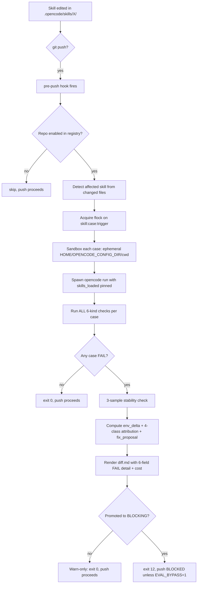
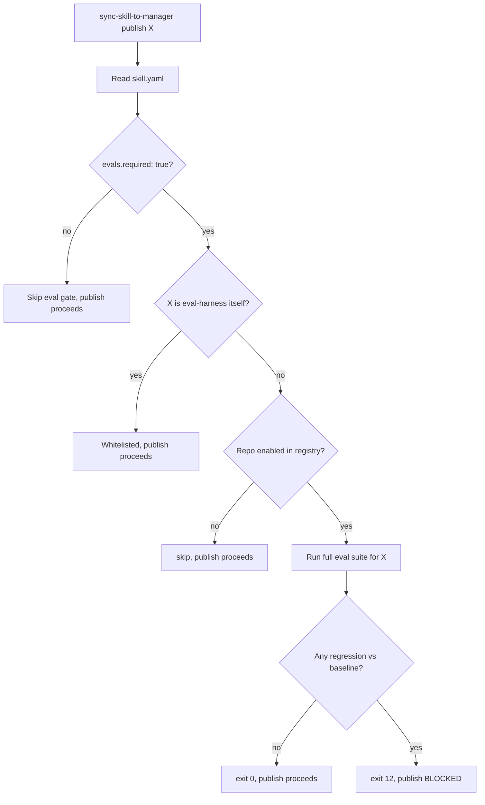

# @nano-step/eval-harness

**v0.4.0** — Behavior-regression eval harness for [opencode](https://github.com/sst/opencode) skills.

> **Scope statement.** eval-harness measures **behavior regression** for opencode skills. It is NOT a skill reviewer, NOT a quality grader, NOT a general-purpose evaluator. v0.4.0 covers structured-output skills (5 deterministic check kinds) AND prose-output skills (1 LLM-judge check kind, optional). Skill design review (frontmatter shape, trigger collisions, OWASP greps, bundle size) is a separate concern, deferred to a future `skill-reviewer` tool.

## What it does

Given a baselined opencode skill, eval-harness detects when behavior has regressed since the baseline, attributes the cause, and tells you exactly what changed.

```
$ git push origin main
[eval-harness] pre-push: detected change in .opencode/skills/omo-session-distiller/**
[eval-harness] running 3 cases (skills-only scope, smoke tier)
[eval-harness] Case 1/3 atom-shape-basic                       PASS (3.9s, $0.0012)
[eval-harness] Case 2/3 atom-tags-decision-architecture        FAIL
[eval-harness] Case 3/3 atom-redaction-pii                     PASS (3.1s, $0.0009)
[eval-harness] Stability check: 3 samples byte-identical → real FAIL
[eval-harness] FAIL 1/3 — see runs/2026-05-30T11-42-08/diff.md
[eval-harness] fix_proposal: missing tag "architecture" in $.atoms[].tags[]
[eval-harness] WARN-ONLY MODE: push proceeding. Promote with `eval-harness promote`.
```

## Install

```bash
npm install -g @nano-step/eval-harness
```

Or use directly from a clone:

```bash
git clone https://github.com/nano-step/eval-harness.git
export PATH="$PWD/eval-harness/scripts/eval:$PATH"
```

## Quick start (5 min)

```bash
# 1. Run the canonical demo (mutates omo-session-distiller, runs eval, reverts)
npm test

# 2. Use it on a real skill — first baseline
eval-harness baseline --skill omo-session-distiller

# 3. Edit the skill, then run again
eval-harness run --skill omo-session-distiller
# → exit 12 if regression detected (only when promoted)
```

For prose-output skills (requires `ANTHROPIC_API_KEY`):

```bash
eval-harness run --skill pr-code-reviewer --mode=full   # uses LLM judge with 3-sample majority
eval-harness run --skill pr-code-reviewer --mode=2tier  # cheap smoke first, escalate to full on FAIL
```

## Architecture

```
scripts/eval/
├── run.sh                    # entrypoint: --skill --case --mode --trigger --stability-samples --debug
├── twotier.sh                # smoke → full escalation orchestrator
├── baseline.sh               # writes baseline.json (explicit command)
├── accept.sh                 # accept --case [--bless-env]
├── status.sh                 # pull-only result inspection
├── promote.sh                # warn-only → blocking promotion
├── trend.sh                  # reads history.ndjson
├── lib/
│   ├── yq-shim.sh + _yq.py   # python-backed yq fallback (no yq binary required)
│   ├── skills_root.sh        # OPENCODE_SKILLS_ROOT resolution (env > walk-up > user-global)
│   ├── config.sh             # project-config layer (.opencode/eval-harness.yaml)
│   ├── registry.sh           # per-repo opt-in (43-repo workspace support)
│   ├── preflight.sh          # opencode binary + API key probe (fail-fast)
│   ├── lock.sh               # flock(1) coordinator (mkdir fallback for macOS)
│   ├── spawn.sh              # invokes `opencode run` with sandboxed env
│   ├── manifest.sh           # env-manifest capture (sha + model + version + platform)
│   ├── score.sh              # runs all 6 check kinds against transcript + fs
│   ├── llm_judge.sh          # Anthropic API call, 3-sample majority voting
│   ├── autofix.sh            # heuristic fix_proposal enrichment
│   ├── pricing.sh            # token → dollar conversion + staleness gate
│   ├── stability.sh          # 3-sample byte-identical check on FAIL
│   ├── diff.sh               # 6-field FAIL output + per-case cost + stability
│   └── attribute.sh          # 4-class attribution decision tree
├── hooks/
│   ├── pre-push              # git hook installer target
│   ├── sync-publish.sh       # sync-skill-to-manager pre-publish hook
│   ├── opencode-stop.sh      # scaffold (gated on opencode ≥ 1.16 plugin API)
│   └── HOOKS.md              # hook reference
└── tests/                    # 11 test suites — see "Verify" section
```

## Design highlights

- **Bash + jq + flock**. No daemon, no Node CLI, no Unix socket. Python only as a `yq` fallback.
- **3 active triggers + 1 scaffold**: `sync-skill-to-manager` pre-publish · git `pre-push` on skill edits · manual `eval-harness run` · opencode Stop hook (scaffolded; activates on opencode ≥ 1.16).
- **6-field FAIL schema**: `failed_check_id`, `expected`, `actual`, `diff_hint`, `transcript_span`, `env_delta`.
- **4-class attribution**: `SKILL_CHANGED`, `FIXTURE_STALE`, `MODEL_CHANGED`, `UNKNOWN_DRIFT`. Tagged `flaky:true` when 3-sample stability check finds samples diverged.
- **2-tier execution mode**: `--mode=smoke` (cheap haiku, 1 LLM-judge sample) by default. `--mode=full` (configured model, 3 samples). `--mode=2tier` runs smoke, re-runs only failed cases with full.
- **Dollar cost per case**: `pricing.json` curated rates for haiku-3-5, sonnet-4-6, opus-4-7. `summary.total_cost_usd` per run. Staleness gate (default 60 days).
- **Per-(case,trigger) lockfile**: `flock(1)` serializes concurrent invocations on the same skill+case+trigger.
- **Per-repo opt-in registry**: required for 43-repo workspaces. Manual trigger always runs; automated triggers (pre-push / sync-publish / stop-hook) skip non-enabled repos.
- **Project-config layer**: `.opencode/eval-harness.yaml` walked up from cwd. Env vars win when explicitly set.
- **Per-case model override**: case YAML `.model` field. Resolution: case > env > project config > built-in.
- **3-sample byte-identical stability check** on FAIL → flaky tag if mismatch, no false attribution.
- **Warn-only by default** for 7 days. Promote with `eval-harness promote`.
- **Two-stage `accept`**: default updates fixtures only; `--bless-env` required to update env-manifest (with confirmation).
- **Heuristic auto-fix proposals** (v0.4.0): every FAILED check on a safe kind carries a `.fix_proposal` with `instruction` + `patch_snippet`. Never auto-applies — proposes only.
- **Cost ceiling**: `EVAL_BUDGET_USD=2.00` hard daily cap. Tokens-based capture.
- **One-command rerun** in every FAIL output.

---

## What this harness scores (the factors)

Be explicit about what is and isn't checked. eval-harness evaluates **two layers** with different jobs:

### Layer 1 — Behavior factors (eval-harness itself, this repo, this version)

Every case in `.opencode/skills/<skill>/evals/cases/*.yaml` declares one or more **checks**. The harness runs **all checks** per case and aggregates failures. v0.4.0 supports **6 check kinds**:

| # | Check kind | What it scores | Reliability |
|---|---|---|---|
| 1 | `shell`               | Runs a shell command in the case workdir; matches stdout against `expect_regex` / `expect_min` / `expect_exact`. | High — deterministic. |
| 2 | `jq_path_contains`    | Reads a JSON file in workdir, walks a jq path, asserts the result array contains all `contains:` values. | High — deterministic. |
| 3 | `file_exists`         | Asserts a file exists at the given path in workdir. | High — deterministic. |
| 4 | `output_contains`     | Greps the opencode transcript for a literal string. Records `transcript_span` on hit. | High — deterministic, literal-only. |
| 5 | `output_not_contains` | Inverse of #4. Used for refusal / forbidden-output checks. | High — deterministic, literal-only. |
| 6 | `llm_judge`           | Calls Anthropic Messages API (default `claude-sonnet-4-6`, configurable to `claude-opus-4-7`) with a rubric. 3-sample majority voting. **Returns `verdict: null` honestly** when API key missing, response unparseable, or majority null — never fabricates a verdict. | Medium — model-judged, with explicit failure modes. |

If your case YAML uses an unrecognised `kind:`, the harness emits an `error: true` result and excludes it from regression diff — it does not silently pass.

### Layer 2 — Environment & attribution factors (for FAIL diagnosis)

When a case fails, the harness attributes the cause using environment-manifest fields captured per run:

| Manifest field | Catches |
|---|---|
| `skill_bundle_sha` (transitive hash of all skills) | `SKILL_CHANGED` |
| `skill_sha` (just this skill) | `SKILL_CHANGED` (narrower) |
| `fixture_sha` (case fixture directory) | `FIXTURE_STALE` |
| `model_id` + `opencode_version` | `MODEL_CHANGED` |
| (none of the above changed) | `UNKNOWN_DRIFT` |
| 3-sample stability divergence | `flaky: true` tag on attribution |

`MCP_FLAKE` and `HARNESS_BUG` are designed but not shipped (deferred until they bite).

### Layer 3 — Skill *design* factors (NOT in this repo)

A separate concern, deferred to a future `skill-reviewer` tool. eval-harness does **not** review skill design quality (trigger phrase collisions, frontmatter shape, examples present, security greps, bundle size, etc.).

A draft heuristic for design review lives at [`standards/skill-quality-v1.md`](./standards/skill-quality-v1.md). Read it understanding that:

- **13 of 30 factors** are grounded in real sources (Anthropic Skills doc + OWASP shell-security greps + MCP tool conventions). Reliable to apply.
- **17 of 30 factors** are heuristic synthesis from pattern-matching across one workspace. Use with judgment; treat as "things to consider," not "things that pass/fail."
- There is **no published, authoritative skill-quality benchmark** in the industry today. Anyone claiming one is synthesising — same as we are. This doc is honest about which factors are grounded vs invented.

---

## The review workflow — how factors get enforced

There are **two active workflows + one scaffold** in v0.4.0. Each enforces a specific subset of factors at a specific gate.

### Workflow A — Behavior regression (automatic, every push)



**Factors enforced**: Layer 1 (6 check kinds) + Layer 2 (4 attribution fields + flaky tag). Plus dollar-cost accounting + auto-fix proposals.

### Workflow B — Pre-publish (opt-in, before npm publish)



### Workflow C — opencode Stop hook (scaffold)

Scaffolded in v0.2.0, **inactive** until opencode ≥ 1.16 plugin API ships. The hook parses `OPENCODE_CHANGED_FILES` and re-runs evals for any touched skill. Until upstream lands the plugin API, the script is a no-op (exit 0 with a one-line skip message). See [`scripts/eval/hooks/HOOKS.md`](./scripts/eval/hooks/HOOKS.md) for manual invocation.

### What each workflow does NOT enforce

| Concern | Workflow A (push) | Workflow B (publish) | Status |
|---|---|---|---|
| Trigger phrase collision with other skills | ❌ | ❌ | Future `skill-reviewer` tool |
| Frontmatter schema validation | ❌ | ❌ | Future `skill-reviewer` tool |
| OWASP shell-security greps | ❌ | ❌ | Future `skill-reviewer` tool |
| Bundle size / context cost | ❌ | ❌ | Future `skill-reviewer` tool |
| Prose output quality | ✅ via `llm_judge` | ✅ via `llm_judge` | Shipped v0.3.0 (requires `ANTHROPIC_API_KEY`) |
| Cross-skill behavioral interaction | ⚠️ partial (via `skill_bundle_sha`) | ⚠️ partial | Tracked but not gated |
| Cost regression (tokens/dollars rising) | ⚠️ captured per-case, not gated | ⚠️ captured | Shipped v0.2.0 (visibility only; gating is v0.5.0+) |
| Stop-hook on idle | 🚧 scaffold | n/a | Activates on opencode ≥ 1.16 |

This table is the **honest scope statement**. Anything not in Workflow A/B (or actively scaffolded in C) is not enforced.

---

## How to verify the harness is actually running these factors

Four reproducible commands, each scoped to a different layer:

```bash
# Layer 1 + Layer 2 — full pipeline including attribution
npm test
# → runs scripts/eval/tests/regression_inject.sh
# → asserts: verdict=REGRESSION, attribution=SKILL_CHANGED, 6-field FAIL populated
# → exit 0 = harness is real

# Layer 1 — dry-run case discovery only (no API spend; preflight still runs)
EVAL_SKIP_AUTH_CHECK=1 eval-harness run --skill=<your-skill> --dry-run

# Layer 1 — single check kind in isolation
bash scripts/eval/lib/score.sh check <one-check.yaml> <workdir> <transcript>

# Full test suite — 11 suites covering every primitive
for t in scripts/eval/tests/*.sh; do bash "$t"; done
# → all should print PASS
```

If you need to know whether a specific factor is being checked, point at the case YAML — `.checks[]` is the complete list of factors that case enforces. There is no hidden scoring.

### Verified test suites (11/11 green on `main`)

| Suite | Covers |
|---|---|
| `regression_inject.sh`  | End-to-end demo: inject regression, assert SKILL_CHANGED + 6-field FAIL |
| `case_model_override.sh` | Per-case `.model` field flows into env-manifest |
| `project_config.sh`     | `.opencode/eval-harness.yaml` + env-var precedence |
| `registry.sh`           | init / enable / disable / list / is-enabled / repo-name |
| `lock_concurrency.sh`   | Two parallel same-case runs serialized via flock |
| `pricing.sh`            | Cost math + staleness states (FRESH/STALE/MISSING) + token extraction |
| `stability_inline.sh`   | 3-sample byte-identical hashing on FAIL |
| `stop_hook.sh`          | Version gate + empty changed-set handling |
| `llm_judge_unit.sh`     | PASS / FAIL / ERROR paths + 3-sample majority + missing-key fallback |
| `twotier_mode.sh`       | Smoke pins haiku, full pins sonnet-4-6, 2tier orchestrates, invalid mode rejected |
| `autofix.sh`            | Fix proposals for output_contains / output_not_contains / jq_path_contains / file_exists; null for llm_judge & passing checks |

## Triggers

| Trigger | Mode | Blocks? | Cases |
|---|---|---|---|
| `sync-skill-to-manager` pre-publish | sync, no timeout | warn-only (promote to block) | full suite for skill |
| git `pre-push` | sync, 60s timeout | warn-only (promote to block) | affected fast cases |
| manual (`eval-harness run`) | sync, foreground | n/a | user-specified |
| opencode Stop hook | scaffold (inactive until opencode ≥ 1.16) | n/a | skills with changed files |

## Configuration

### `.opencode/eval-harness.yaml` (per-project, optional)

```yaml
model: anthropic/claude-3-5-haiku-latest
budget_usd: 2.00
max_seconds: 180
llm_judge:
  model: anthropic/claude-sonnet-4-6
```

Walked up from cwd. Explicit env vars (`EVAL_MODEL`, `EVAL_BUDGET_USD`, etc.) still win.

### Per-repo registry (required for 43-repo workspaces)

```bash
bash scripts/eval/lib/registry.sh enable <repo-name>   # opt repo into automated triggers
bash scripts/eval/lib/registry.sh list                 # show enabled repos
```

Default path: `~/.config/opencode/eval-harness/registry.yaml`. Override with `$EVAL_HARNESS_REGISTRY`.

### Pricing data

[`pricing.json`](./pricing.json) carries curated input/output per-Mtok USD rates for haiku-3-5, sonnet-4-6, opus-4-7. Update the `as_of` date and rates when Anthropic prices change; the staleness gate warns after 60 days (configurable via `stale_after_days` in the file, or `EVAL_FAIL_ON_STALE_PRICING=1` to refuse runs).

## Limitations (read before using)

1. **opencode 1.15.10 verified.** opencode ≥ 1.16 needed to activate the Stop hook; earlier versions: file an issue.
2. **No `--max-turns` / `--skills` flags exist in opencode** → enforced via filesystem (ephemeral `OPENCODE_CONFIG_DIR` + external `timeout(1)` + token-counted kill).
3. **No real network calls** in default mode. `--realenv` flag for opt-in quarantined cases.
4. **LLM judge requires `ANTHROPIC_API_KEY`.** Without one, `llm_judge` checks return `verdict: null` with `reason: judge_unavailable` — this is by design (we never fabricate a verdict). Set the key to use prose-output evaluation.
5. **Deterministic mode only** (T=0, k=1). Stochastic `pass@k` deferred to v0.5+.
6. **Auto-fix proposes, never applies.** v0.4.0 attaches `fix_proposal` to FAILED checks but `auto_apply: false`. Application logic is v0.5.0+.
7. **Cost is captured, not gated.** Per-case + per-run dollar amounts surface in `results.json`, but only `EVAL_BUDGET_USD` (daily token cap) hard-stops execution. Cost-regression gating is v0.5.0+.

## Authoring a case (5 min)

Structured-output case (deterministic, no API cost beyond the spawn):

```yaml
schema_version: 2
id: smoke-001-my-case
mode: deterministic
skill_under_test: omo-session-distiller
skills_loaded: [omo-session-distiller]
description: "Skill must produce atoms with required keys"

setup:
  fixtures:
    "session.json": ./fixtures/session-input.json

prompt: "Distill the session at session.json. Write JSON atoms to atoms.json."

budget:
  max_tokens: 50000
  max_seconds: 180

checks:
  - kind: shell
    cmd: "jq -r '.atoms | length' atoms.json"
    expect_min: 1
  - kind: jq_path_contains
    file: atoms.json
    path: "$.atoms[0].tags"
    contains: ["decision", "architecture"]
```

Prose-output case (uses `llm_judge`, needs `ANTHROPIC_API_KEY`):

```yaml
schema_version: 2
id: review-must-flag-sql-injection
mode: prose
skill_under_test: pr-code-reviewer
skills_loaded: [pr-code-reviewer]
model: anthropic/claude-sonnet-4-6   # optional per-case override

setup:
  fixtures:
    "diff.patch": ./fixtures/pr-sql-injection.diff

prompt: "Review the diff in diff.patch. Write your review to review.md."

checks:
  - kind: file_exists
    path: review.md
  - kind: llm_judge
    target_file: review.md
    samples: 3
    judge_model: anthropic/claude-sonnet-4-6   # optional; defaults to EVAL_LLM_JUDGE_MODEL
    rubric: |
      The review MUST identify the SQL injection vulnerability AND recommend
      reverting to parameterized queries. PASS only if both are present.
      FAIL if SQL injection is missed or treated as below HIGH severity.
```

Run `eval-harness run --skill=pr-code-reviewer --mode=2tier` to evaluate cheaply with auto-escalation.

## Versions

| Version | Released | Highlights |
|---|---|---|
| **v0.4.0** | 2026-05-29 | Heuristic auto-fix proposer for safe check kinds |
| v0.3.0 | 2026-05-29 | LLM judge (sonnet-4-6 / opus-4-7, 3-sample majority) · `pr-code-reviewer` demo · 2-tier mode |
| v0.2.0 | 2026-05-29 | Project config · per-case model override · per-repo registry · flock lockfile · pricing/cost · stability on critical path · Stop-hook scaffold |
| v0.1.1 | 2026-05-29 | Patch: model ID + demo path + factors README + SQS-1 honesty |
| v0.1.0 | 2026-05-28 | Initial release: bash + pre-push + sync-publish + 4-class attribution + omo-session-distiller demo |

See [`CHANGELOG.md`](./CHANGELOG.md) for details.

## Roadmap

Two independent audits on 2026-05-30 surfaced 8 BLOCKERs + 4 HIGH severity bugs in v0.4.1.
The roadmap below is **honest about that**: hardening comes before features.
See [`KNOWN_ISSUES.md`](./KNOWN_ISSUES.md) for the full pinned bug list.

### v0.4.2 — Hardening release (BLOCKER fixes, ~1-2 days)

Required before recommending eval-harness for anyone but the author.

- Fix `EVAL_BYPASS=1` crash (function-before-definition bug)
- Sandbox or whitelist `score_shell`'s `bash -c "$cmd"` (RCE risk)
- Fix fixture-copy subshell + add `..` path-traversal guard
- Fix `attribute.sh` BRE alternation (SKILL_CHANGED broken on macOS)
- Render `.fix_proposal` in `diff.md` (currently invisible — the v0.4.0 feature)
- Fix `--mode=2tier` verdict aggregation across escalated cases
- Treat empty/missing transcript as harness error, not vacuous PASS
- Handle `timeout(1)` exit 124 as harness error, not silent partial-transcript scoring
- Commit real baselines for `omo-session-distiller` and `pr-code-reviewer`
- Add `KNOWN_ISSUES.md` honest disclosure

### v0.4.3 — Correctness polish (~1 day)

- `trap` for lock fd / mkdir-lock cleanup on SIGINT/SIGTERM
- Larger run-ID collision space (`$RANDOM$RANDOM` or `openssl rand`)
- `flock` the `history.ndjson` append
- LLM-judge verdict parser: scan only first line of response
- Cap `samples:` field in case YAML (prevent runaway cost)
- Delete or fix `propose_fixes_for_run` tautology bug (dead code today)
- Preflight `python3` + `pyyaml` presence (yq-shim silently breaks without them)
- Remove `$workdir` PATH-prepend or restrict to `$workdir/bin/` only

### v0.5.0 — CI-ready (~1 week)

The version that's actually safe to recommend for CI/CD gating.

- `--strict` mode (flip warn-only off; exit 12 on first regression)
- `--ci` mode + JUnit / SARIF reporter + PR-comment integration
- Shared-state daily budget ledger (`EVAL_BUDGET_USD` actually enforced across runs)
- Cost-regression gating (block PRs that raise per-case $ vs baseline)
- Self-eat suite: `skills/eval-harness/evals/cases/*.yaml` for the harness itself
- Auto-fix **applier** (v0.4.0 only proposes; v0.5 would apply with explicit confirmation)

### v0.6.0 — DX polish

- Branch-filter for pre-push (skip WIP branches)
- Cross-skill behavioral interaction diagnosis (which skill broke which?)
- Automatic warn-only → blocking promotion after N green days
- A/B mode (`eval-harness ab --base=X --candidate=Y`)
- opencode Stop-hook activation once plugin API lands

### v0.7.0 — Scale

- Anthropic API rate-limit handling + exponential backoff
- Per-run cost cap (`EVAL_BUDGET_USD` currently daily-only)
- Judge response caching by `(rubric_hash + artifact_hash)` — don't re-burn tokens on identical artifacts
- Stochastic `pass@k` mode (T>0, multiple samples)
- `MCP_FLAKE` + `HARNESS_BUG` attribution classes

### v1.0.0 — Stable

Trigger: all BLOCKERs from v0.4.1 audits closed; harness self-eaten on its own evals; CI-proven on at least 2 external repos; semver + deprecation policies published; `--ci` mode adopted by ≥1 real CI pipeline.

### Out of scope (separate project)

**`skill-reviewer`** — Layer-3 design review (frontmatter schema, trigger-phrase collisions, OWASP shell greps, bundle size, examples-present, deprecation references). Different tool, different repo, different release cadence. See [`standards/skill-quality-v1.md`](./standards/skill-quality-v1.md) for the draft rubric.

---

> *Forged in the regression furnace.*
> MIT · Hoài Nhớ · [nano-step](https://github.com/nano-step)
