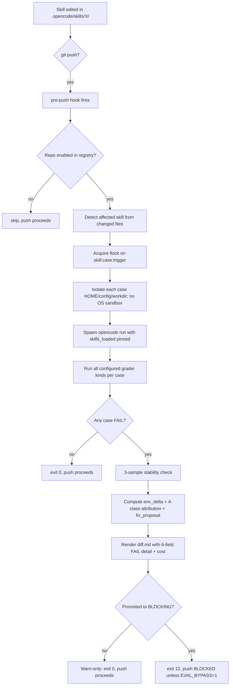
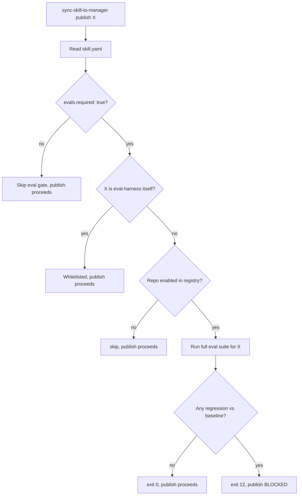

# @nano-step/eval-harness

**v0.5.0** — typed evaluation harness for [OpenCode](https://github.com/sst/opencode) skills.
> Adds capability, behavior-regression, and product-quality evaluation; versioned grading manifests; deterministic metric, trajectory, and human-review graders; explicit PASS / FAIL / ERROR / NEEDS_REVIEW / INDETERMINATE outcomes; and provenance-aware reports.
> **Scope.** eval-harness evaluates declared behavior and product measurements. It does not review skill design, invent missing measurements, or collapse product dimensions into a single score. `run` remains the OpenCode execution adapter; `grade` evaluates content-addressed artifacts from any runner.

## What it does

Each case declares an `eval_type`: `capability`, `regression`, or `product`. Required checks gate the typed result; product dimensions remain separate, independently reported measurements. Use `run` to execute an OpenCode skill, or `grade --manifest=...` to score content-addressed artifacts without starting a model.

```
Illustrative output; not a measured run transcript:
$ eval-harness run --skill=example-skill
[eval-harness] Case 1/2 capability-shape PASS
[eval-harness] Case 2/2 regression-contract FAIL
[eval-harness] REGRESSION (1/2) — regressions: regression-contract
[eval-harness] WARN-ONLY MODE: regression recorded; use --strict or promote to block.
```

## Install

This release is distributed from GitHub; the npm registry package is not published. To install the checked-out source package and expose its CLI:

```bash
git clone https://github.com/nano-step/eval-harness.git
cd eval-harness
npm link
```

Running npm link creates a local symlink to this checkout; it does not publish or download a registry package. Node.js 18+ is required.

## Quick start

```bash
# Run the local shell test suite (offline fixtures and stubbed runners)
npm test
eval-harness --version

# Point at a directory containing <skill-name>/evals/cases/*.yaml.
export OPENCODE_SKILLS_ROOT="/path/to/skills-root"

# After installing OpenCode and adding evals for your skill:
eval-harness run --skill=my-skill --dry-run
eval-harness run --skill=my-skill

# Record a passing baseline, then enforce the declared gates on later runs.
eval-harness baseline --skill=my-skill
eval-harness run --skill=my-skill --strict
```


For provider-neutral grading, prepare a deterministic case/workdir/transcript and a content-addressed schema-1 grading manifest, then run eval-harness grade --manifest=grading-manifest.json --strict. Stochastic aggregate manifests are rejected because a single workdir cannot represent multiple trials. The grader never starts a model.

OpenCode is the default execution adapter. For `runner: langgraph-node` cases, see the [runner contract](./docs/runners.md) and [LangGraph example](./examples/langgraph-runner/).

Use `eval-harness ab --base=skill-a --candidate=skill-b --base-model=provider/model-a --candidate-model=provider/model-b --warn-cost-increase-pct=20` for a side-by-side comparison. The cost threshold warns only; case failures and unavailable evidence remain gates.
For llm_judge prose checks, set ANTHROPIC_API_KEY and use --mode=full or --mode=2tier. Unresolved judge votes remain unavailable; they never become PASS.

Optional `--report=junit:path` and `--report=sarif:path` outputs export the run as JUnit XML or SARIF 2.1.0. `eval-harness metaeval` runs a bundled stub-only corpus and writes harness-validity metrics separately from skill results.

## Architecture

- scripts/eval/run.sh — OpenCode execution adapter and run lifecycle
- scripts/eval/grade.sh — provider-neutral grading from a versioned evidence manifest
- scripts/eval/ab.sh — typed A/B comparison with optional per-side model overrides
- scripts/eval/lib/safe_shell.py — constrained argv runner for implicit-safe shell checks
- scripts/eval/lib/extended_graders.sh — metric, trajectory, and human-review graders
- scripts/eval/lib/grading_manifest.sh — content-addressed case, workdir, transcript, and artifact manifest
- scripts/eval/lib/manifest.sh — environment and prompt/rubric/tool fingerprints (schema 4)
- scripts/eval/lib/diff.sh — typed case/run results, resource coverage, and Markdown report
- scripts/eval/lib/attribute.sh — evidence classification; never causal proof
- scripts/eval/lib/stats.sh — stochastic reliability estimates and Wilson intervals
- scripts/eval/lib/budget.sh — daily budget ledger; unknown costs remain unknown
- scripts/eval/lib/report_junit.sh and report_sarif.sh — optional JUnit XML and SARIF exports
- scripts/eval/metaeval.sh — offline harness false-positive, false-negative, and attribution metrics
- scripts/eval/tests/ — deterministic regression and dogfood suites

## Case types and result states

Each case has an eval_type:

| Type | Purpose | Baseline behavior |
|---|---|---|
| regression (default) | Preserve an existing behavior contract | Baseline comparison enabled |
| capability | Verify declared capabilities | No baseline comparison unless explicitly enabled |
| product | Report independent product-quality dimensions | No baseline comparison unless explicitly enabled |

The top-level result retains the legacy passed boolean and adds status: PASS, FAIL, ERROR, NEEDS_REVIEW, or INDETERMINATE. A regression is specifically a case that compared against a baseline with passed=true and now has status=FAIL. Missing required evidence is not a pass or a measured zero.

## Supported check kinds

| Kind | Evidence and gate |
|---|---|
| shell | Safe command output matched against expect_regex, expect_min, expect_exact, or ordered expect_exact_lines |
| jq_path_contains | JSON value contains the declared required items |
| file_exists | Declared workdir file exists |
| output_contains | Literal transcript match; unavailable transcript -> INDETERMINATE |
| output_not_contains | Literal absence check; unavailable transcript -> INDETERMINATE |
| llm_judge | Optional model grader; abstentions remain unavailable, never synthetic PASS |
| metric_score | Numeric JSON metric in [0,1], with optional minimum and named dimension |
| trajectory | Ordered JSONL events with declared tool/skill/retry/verification/repair constraints |
| human_review | Content-addressed review sidecar; missing or pending review -> NEEDS_REVIEW |

Unknown kinds, malformed case configuration, no checks, or no required checks produce ERROR. Optional checks report evidence but do not gate. For each named product dimension, numeric check scores use the declared positive weights; missing values make that dimension unavailable. The harness does not emit a single weighted product score.

## Reliability and resources

Stochastic cases report pass@k = 1-(1-p)^k and pass^k = p^k using repeated attempts of the same case/configuration, plus Wilson confidence bounds. Attempts are not pooled across heterogeneous cases; stability reruns are diagnostic, not independent samples. IID is an explicit assumption, not a measured property. See the v2 design (docs/EVAL_HARNESS_V2.md).

Tokens, cost, and duration each carry measured/partial/unavailable coverage. Total cost is null unless every case has measured cost; the measured subtotal remains separately labeled. If EVAL_BUDGET_USD is set, an unmeasured ledger entry blocks later budget-gated runs until reconciled; it is never recorded as $0.

## Provenance and baseline compatibility

Environment manifests use schema 4 and bind the SUT skill, bundle, fixture, prompt, rubric, and optional tool manifest hashes plus model/runtime/platform. Older environment baselines remain readable; newly introduced hashes are ignored when absent from a legacy baseline. Attribution classes include SKILL_CHANGED, CROSS_SKILL_CHANGE, FIXTURE_STALE, MODEL_CHANGED, PROMPT_CHANGED, RUBRIC_CHANGED, TOOL_MANIFEST_CHANGED, ENVIRONMENT_CHANGED, EVIDENCE_AVAILABILITY_CHANGED, NON_DETERMINISTIC_DRIFT, NO_BASELINE, and UNKNOWN_DRIFT. Cross-skill hashes are co-occurrence evidence, not proof of causality.

Baseline records use schema 3 and retain `source_run_id`, the content-addressed grading-manifest reference, and existing checksum verification; schema-2 records remain readable. Baseline and acceptance commands bind writes to the run they executed or explicitly selected; initial baselines and accept require a verified PASS. Rebaseline refuses unavailable evidence and only accepts failing behavior with the explicit --accept-model-change override.

## Provider-neutral grading

Run `eval-harness grade --manifest=grading-manifest.json` to grade without invoking a model. Manifest schema 1 binds the case file, workdir tree, transcript, selected artifacts, environment manifest, run/case IDs, and provenance with content digests. Paths must resolve inside the manifest root. `--strict` exits 14 for FAIL, 15 for NEEDS_REVIEW, 16 for INDETERMINATE, and 13 for malformed or tampered evidence. The manifest format is generic JSON; this release does not load arbitrary evaluator plugins. The Janus 0.1.10 eval-feature benchmark found no candidate executor invocation and a PASS for empty checks; see [JANUS_BENCHMARK.md](./docs/JANUS_BENCHMARK.md).

## Other gates and deferred scope

A/B comparison can override the base/candidate model independently and reports dimensions, token/cost/duration deltas without collapsing dimensions. Its optional cost-increase percentage is warning-only. Ordinary promotion requires a green daily-stats record for every day in the configured seven-day window (and no bypasses); --force is the explicit override. Auto-promotion uses the same readiness check.

The pre-push hook supports optional include/exclude branch globs in .opencode/eval-harness.yaml under pre_push.branches; include matches take precedence if both lists are set.

This project evaluates declared behavior and measurements. It does not audit skill design quality, perform visual reconstruction review, or prove that a changed manifest field caused an outcome. The separate draft skill-design rubric is at standards/skill-quality-v1.md. Research and the full migration/API contract are in docs/ECC_RESEARCH.md and docs/EVAL_HARNESS_V2.md.


---

## The review workflow — how factors get enforced

There are **two active workflows + one scaffold**. Each enforces a specific subset of factors at a specific gate.

### Workflow A — Behavior regression (automatic, every push)


```mermaid
flowchart TD
  A[Skill edited in .opencode/skills/X/] --> B{git push?}
  B -- yes --> C[pre-push hook fires]
  C --> D{Repo enabled in registry?}
  D -- no  --> Z[skip, push proceeds]
  D -- yes --> E[Detect affected skill from changed files]
  E --> F[Acquire flock on skill:case:trigger]
  F --> G["Isolate each case HOME/config/workdir; no OS sandbox"]
  G --> H[Spawn opencode run with skills_loaded pinned]
  H --> I[Run all configured grader kinds per case]
  I --> J{Any case FAIL?}
  J -- no --> K[exit 0, push proceeds]
  J -- yes --> L[3-sample stability check]
  L --> M[Compute env_delta + 4-class attribution + fix_proposal]
  M --> N[Render diff.md with 6-field FAIL detail + cost]
  N --> O{Promoted to BLOCKING?}
  O -- no  --> P[Warn-only: exit 0, push proceeds]
  O -- yes --> Q[exit 12, push BLOCKED unless EVAL_BYPASS=1]
```

**Factors enforced**: configured grader kinds + typed attribution fields + flaky tag, plus cost accounting and auto-fix proposals.

### Workflow B — Pre-publish skill-manager gate (opt-in)


```mermaid
flowchart TD
  A[sync-skill-to-manager publish X] --> B[Read skill.yaml]
  B --> C{evals.required: true?}
  C -- no --> D[Skip eval gate, publish proceeds]
  C -- yes --> E{X is eval-harness itself?}
  E -- yes --> F[Whitelisted, publish proceeds]
  E -- no  --> G{Repo enabled in registry?}
  G -- no  --> Y[skip, publish proceeds]
  G -- yes --> H[Run full eval suite for X]
  H --> I{Any regression vs baseline?}
  I -- no --> J[exit 0, publish proceeds]
  I -- yes --> K[exit 12, publish BLOCKED]
```

### Workflow C — opencode Stop hook (scaffold)

Scaffolded in v0.2.0, **inactive** until opencode ≥ 1.16 plugin API ships. The hook parses `OPENCODE_CHANGED_FILES` and re-runs evals for any touched skill. Until upstream lands the plugin API, the script is a no-op (exit 0 with a one-line skip message). See [`scripts/eval/hooks/HOOKS.md`](./scripts/eval/hooks/HOOKS.md) for manual invocation.

### What each workflow does NOT enforce

| Concern | Workflow A (push) | Workflow B (publish) | Status |
|---|---|---|---|
| Trigger phrase collision with other skills | ❌ | ❌ | Future `skill-reviewer` tool |
| Frontmatter schema validation | ❌ | ❌ | Future `skill-reviewer` tool |
| OWASP shell-security greps | ❌ | ❌ | Future `skill-reviewer` tool |
| Bundle size / context cost | ❌ | ❌ | Future `skill-reviewer` tool |
| Prose output quality | ✅ via `llm_judge` | ✅ via `llm_judge` | Shipped v0.3.0 (requires `ANTHROPIC_API_KEY`) |
| Cross-skill behavioral interaction | ⚠️ partial (via `skill_bundle_sha`) | ⚠️ partial | Tracked but not gated |
| Cost regression (tokens/dollars rising) | ⚠️ captured per-case, not gated | ⚠️ captured | Shipped v0.2.0 (visibility only; gating is v0.5.0+) |
| Stop-hook on idle | 🚧 scaffold | n/a | Activates on opencode ≥ 1.16 |

This table is the **honest scope statement**. Anything not in Workflow A/B (or actively scaffolded in C) is not enforced.

---

## Verify the harness

The package test command runs scripts/eval/test.sh, which discovers and executes every shell suite under scripts/eval/tests. These tests use local fixtures and stubbed runners; they do not measure live model quality, latency, or cost.

```bash
npm test
eval-harness --version
eval-harness run --skill=my-skill --dry-run
```

The skill must exist under OPENCODE_SKILLS_ROOT and contain evals/cases/*.yaml. The dry run checks discovery and preflight without spawning an evaluation run. For a specific gate, inspect the selected case YAML; its checks array is the complete list of enforced graders.


## Triggers

| Trigger | Mode | Blocks? | Cases |
|---|---|---|---|
| `sync-skill-to-manager` pre-publish | sync, no timeout | warn-only (promote to block) | full suite for skill |
| git `pre-push` | sync, 60s timeout | warn-only (promote to block) | affected fast cases |
| manual (`eval-harness run`) | sync, foreground | n/a | user-specified |
| opencode Stop hook | scaffold (inactive until opencode ≥ 1.16) | n/a | skills with changed files |

## Configuration

### `.opencode/eval-harness.yaml` (per-project, optional)

```yaml
model: anthropic/claude-3-5-haiku-latest
budget_usd: 2.00
max_seconds: 180
llm_judge:
  model: anthropic/claude-sonnet-4-6
```

Walked up from cwd. Explicit env vars (`EVAL_MODEL`, `EVAL_BUDGET_USD`, etc.) still win.

### Per-repo registry (required for multi-repo workspaces)

The registry is the opt-in gate for **automated** triggers (pre-push, sync-publish, stop-hook). Manual `eval-harness run` ignores the registry and always works.

```bash
# One repo at a time:
bash scripts/eval/lib/registry.sh enable <repo-name>
bash scripts/eval/lib/registry.sh disable <repo-name>
bash scripts/eval/lib/registry.sh list

# Bulk: opt every skill-bearing repo under a root in one call.
# (Filters out repos that have no .opencode/skills/ — registering them is noise.)
bash scripts/eval/lib/registry.sh enable-workspace --root=/path/to/workspace

# Preview without writing:
bash scripts/eval/lib/registry.sh enable-workspace --root=/path/to/workspace --dry-run

# Tighter filter — only repos that already have evals/cases/*.yaml:
bash scripts/eval/lib/registry.sh enable-workspace --root=/path --filter=cases

# Loosest filter — every .git repo under root, even ones with no skills:
bash scripts/eval/lib/registry.sh enable-workspace --root=/path --filter=all
```

Filter values: `skills` (default — repos with `.opencode/skills/<X>/`), `cases` (repos with eval cases written), `all` (every git repo).

Bulk-register is **idempotent**: re-running with the same args adds zero new entries. It **preserves** any repos enabled manually beforehand (set union, not replace).

Default registry path: `~/.config/opencode/eval-harness/registry.yaml`. Override with `$EVAL_HARNESS_REGISTRY`.

### Wiring the pre-push hook

Keep the harness checkout at a stable absolute path so the hook can load its sibling libraries. For every repository on this machine:

```bash
export EVAL_HARNESS_HOME="$HOME/src/eval-harness"
git config --global core.hooksPath "$EVAL_HARNESS_HOME/scripts/eval/hooks"
```

For one repository only:

```bash
git -C /path/to/your/repo config core.hooksPath "$EVAL_HARNESS_HOME/scripts/eval/hooks"
```

The shared hook path keeps the pre-push script beside the harness libraries; do not copy the script into a standalone hooks directory. The hook only invokes eval-harness when the push touches a skill and the repository is enabled in the registry. Configuring core.hooksPath replaces Git's default hook directory for the selected scope.


### Pricing data

[`pricing.json`](./pricing.json) carries curated input/output per-Mtok USD rates for haiku-3-5, sonnet-4-6, opus-4-7. Update the `as_of` date and rates when Anthropic prices change; the staleness gate warns after 60 days (configurable via `stale_after_days` in the file, or `EVAL_FAIL_ON_STALE_PRICING=1` to refuse runs).

## Limitations (read before using)

1. The run command is an OpenCode adapter. The provider-neutral grade command accepts prepared evidence but does not load arbitrary plugins.
2. The Stop hook remains gated on the OpenCode plugin API version documented in scripts/eval/hooks/HOOKS.md; manual and pre-push runs are independent.
3. llm_judge requires ANTHROPIC_API_KEY. Missing credentials, malformed responses, and unresolved votes remain unavailable/indeterminate; they never become synthetic PASS.
4. Stochastic confidence estimates assume repeated attempts of one case/configuration are IID. That assumption is declared, not empirically validated. Stability reruns are diagnostic only.
5. metric_score accepts one JSON number in [0,1] per check. Dimensions are reported separately; no cross-dimension global product score is computed.
6. human_review consumes a versioned sidecar record. There is no review queue, assignment service, or UI.
7. Token/cost measurements require usage metadata and known pricing. Missing values are unavailable/null, not zero. With EVAL_BUDGET_USD enabled, unknown ledger spend blocks later runs until reconciled.
8. A/B cost-increase thresholds warn only. They do not gate. Use typed case outcomes or explicit required metric checks for blocking behavior.
9. Attribution classifies changed hashes and runtime fields. Hash co-occurrence is not proof of causality.
10. Implicit-safe shell checks accept only a constrained jq/printf/wc -l expression and confine jq files to the workdir; other commands require unsafe_shell: true. That opt-in executes with the harness user's permissions. The workdir is not an OS sandbox, so only run trusted case YAML.

## Authoring a case (5 min)

Structured-output case (deterministic, no API cost beyond the spawn):

```yaml
schema_version: 2
id: smoke-001-my-case
eval_type: regression
mode: deterministic
skill_under_test: omo-session-distiller
skills_loaded: [omo-session-distiller]
description: "Skill must produce atoms with required keys"

setup:
  fixtures:
    "session.json": ./fixtures/session-input.json

prompt: "Distill the session at session.json. Write JSON atoms to atoms.json."

budget:
  max_tokens: 50000
  max_seconds: 180

checks:
  - kind: shell
    cmd: "jq -r '.atoms | length' atoms.json"
    expect_min: 1
  - kind: jq_path_contains
    file: atoms.json
    path: "$.atoms[0].tags"
    contains: ["decision", "architecture"]
```

Product-quality case (deterministic metrics; dimensions stay separate):

```yaml
schema_version: 2
id: geometry-product-check
eval_type: product
compare_to_baseline: false
prompt: "Write product-metrics.json with geometry and appearance scores in [0,1]."
checks:
  - kind: metric_score
    file: product-metrics.json
    path: "$.geometry.topology_score"
    minimum: 0.9
    dimension: geometry
  - kind: metric_score
    file: product-metrics.json
    path: "$.appearance.score"
    minimum: 0.8
    dimension: appearance
```

A missing required metric artifact is INDETERMINATE, not a numeric score of zero or a passing fallback.


Prose-output regression case (uses llm_judge; requires ANTHROPIC_API_KEY):
```yaml
schema_version: 2
id: review-must-flag-sql-injection
eval_type: regression
mode: deterministic
skill_under_test: pr-code-reviewer
skills_loaded: [pr-code-reviewer]
model: anthropic/claude-sonnet-4-6   # optional per-case override

setup:
  fixtures:
    "diff.patch": ./fixtures/pr-sql-injection.diff

prompt: "Review the diff in diff.patch. Write your review to review.md."

checks:
  - kind: file_exists
    path: review.md
  - kind: llm_judge
    target_file: review.md
    samples: 3
    judge_model: anthropic/claude-sonnet-4-6   # optional; defaults to EVAL_LLM_JUDGE_MODEL
    rubric: |
      The review MUST identify the SQL injection vulnerability AND recommend
      reverting to parameterized queries. PASS only if both are present.
      FAIL if SQL injection is missed or treated as below HIGH severity.
```

Run `eval-harness run --skill=pr-code-reviewer --mode=2tier` to evaluate cheaply with auto-escalation.

## Versions

| Version | Status | Highlights |
|---|---|---|
| 0.5.0 | Unreleased working-tree implementation | Typed eval types and statuses; metric/trajectory/human graders; provider-neutral content-addressed grading manifests; schema-4 provenance; pass@k/pass^k; typed resources; fail-closed baseline, budget, A/B, and promotion gates. |
| 0.4.2 | 2026-05-30 | Audit hardening: shell safety, fixture traversal, attribution portability, timeout/empty-transcript handling, 2-tier aggregation. |
| 0.4.1 | 2026-05-30 | npm-link symlink resolution in entrypoint scripts. |
| 0.4.0 | 2026-05-29 | Heuristic auto-fix proposals for safe check kinds. |
| 0.3.0 | 2026-05-29 | LLM judge, prose-output demo, and 2-tier mode. |
| 0.2.0 | 2026-05-29 | Project config, per-case model override, registry, locks, cost reporting, stability. |
| 0.1.1 | 2026-05-29 | Model ID and documentation corrections. |
| 0.1.0 | 2026-05-28 | Initial Bash regression runner and 4-class attribution. |

See CHANGELOG.md for release details.

## Roadmap

The complete v2 design, current capability map, migration contract, and deferred decisions are in docs/EVAL_HARNESS_V2.md. ECC comparison and source evidence are in docs/ECC_RESEARCH.md.

See [`KNOWN_ISSUES.md`](./KNOWN_ISSUES.md) for the remaining HIGH/MEDIUM items, [`CONTRIBUTING.md`](./CONTRIBUTING.md) for how to land a PR, and the [📍 pinned roadmap issue #26](https://github.com/nano-step/eval-harness/issues/26) for the latest priorities.
Remaining work is intentionally evidence-driven: calibrate grader reliability with labeled data; add provider-specific evidence adapters only when they preserve the manifest contract; improve attribution only with causal evidence; and keep human review as a typed record rather than a hidden model guess. No global product score, automatic model grader, or arbitrary plugin execution is planned.

Skill-design review remains a separate concern. See standards/skill-quality-v1.md for the draft rubric, POLICY.md for release rules, KNOWN_ISSUES.md for verified open defects, and CONTRIBUTING.md for repository workflows.

---

> *Forged in the regression furnace.*
> MIT · Hoài Nhớ · [nano-step](https://github.com/nano-step)
